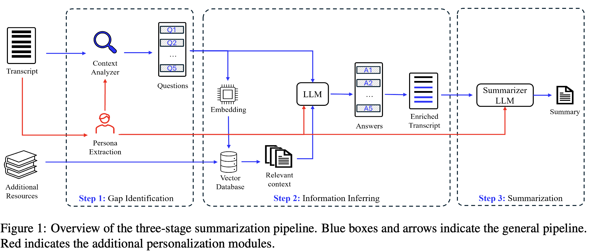
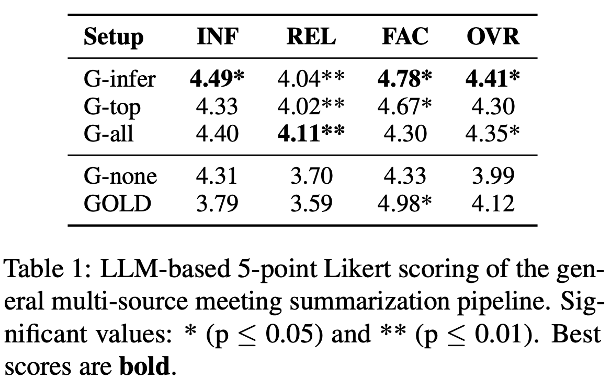
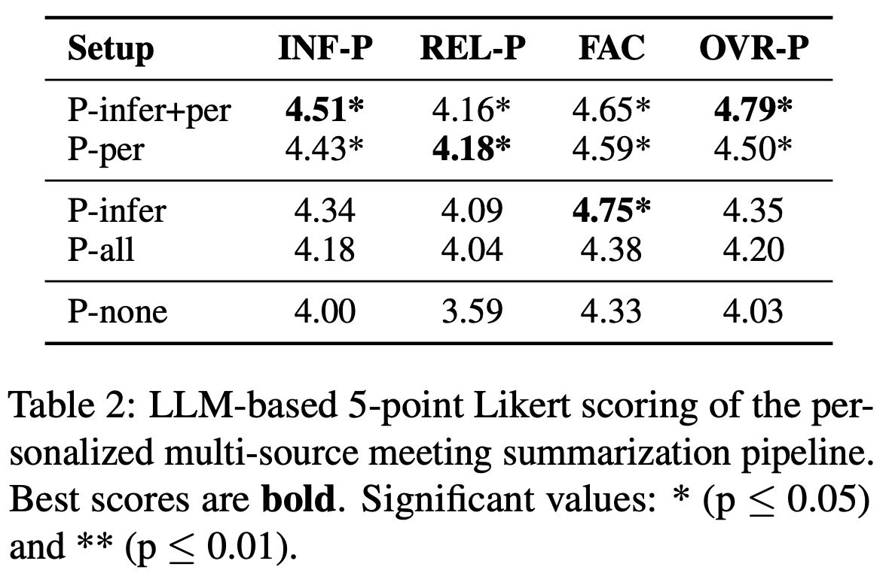
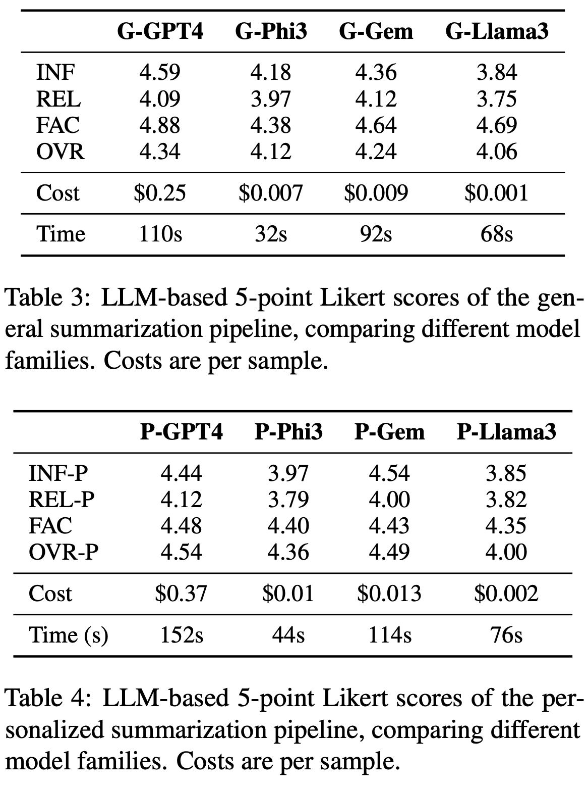

# Tell me what I need to know: Exploring LLM-based (Personalized) Abstractive Multi-Source Meeting Summarization

This software project accompanies the research paper, [Tell me what I need to know: Exploring LLM-based (Personalized) Abstractive Multi-Source Meeting Summarization](https://aclanthology.org/2024.emnlp-industry.69/). **This paper has been accepted by EMNLP 2024 Industry Track.**


## Content of the work
As meetings are typically accompanied by related resources (e.g., e-mail, documents, notes), we analyze how these resources can be used to bolster a summarizer's content understanding and thereby enhance summary quality.
We further explore how this multi-source summarization approach can be used to improve personalization in summaries, allowing for summaries tailored to specific views and incorporating salient knowledge from related sources.

<p align="center">

</p>

## Results
We evaluate the generated summaries using LLM-based metrics adapted from [AUTOCALIBRATE](https://arxiv.org/abs/2309.13308) (INFormativenes, RELevance), [FACTSCORE](https://aclanthology.org/2023.emnlp-main.741/) (FACtuality), and our [Refinement Setup](https://arxiv.org/abs/2407.11919) (OVeRall).

**Summarization pipeline for general summaries**
<p align="center">

</p>

> Structured inclusion of inferred details (G-infer) enhances multi-source summarization quality, beating appending additional sources to the end of the transcript (G-all, G-top).

**Summarization pipeline for personalized summaries**
<p align="center">

</p>

> Detailed persona inclusion improves personalization (REL, INF scores).

**Application of pipelines to smaller models**
<p align="center">

</p>

> GPT-4o is the best for unrestricted use cases, while Phi-3-mini offers good quality for on-device scenarios. Geminiperformssimilarly toGPT4withaslightpriceadvantagebutlessdetailedsummaries.


## Run the project
- code/default_summary.py and code/personalized_summary.py hold the main scripts for our multi-source summarization pipeline. personalized_summary.py is an extension of the other with the persona extraction component included.
- To generate a general summary, run the code/default_summary.py script with the only_general_summary flag set to true
- To generate summaries for multiple meetings, use the code/multi_run_wrapper.py and load the code/default_summary.py or code/personalized_summary.py
- For evaluation, we include an example script with all prompts to evaluate personalized summaries in evaluation/eval_scripts/likert_eval_gpt_PERSONAL.py

## Citation
```
@inproceedings{kirstein-etal-2024-tell,
    title = "Tell me what {I} need to know: Exploring {LLM}-based (Personalized) Abstractive Multi-Source Meeting Summarization",
    author = "Kirstein, Frederic  and
      Ruas, Terry  and
      Kratel, Robert  and
      Gipp, Bela",
    editor = "Dernoncourt, Franck  and
      Preo{\c{t}}iuc-Pietro, Daniel  and
      Shimorina, Anastasia",
    booktitle = "Proceedings of the 2024 Conference on Empirical Methods in Natural Language Processing: Industry Track",
    month = nov,
    year = "2024",
    address = "Miami, Florida, US",
    publisher = "Association for Computational Linguistics",
    url = "https://aclanthology.org/2024.emnlp-industry.69",
    pages = "920--939",
    abstract = "Meeting summarization is crucial in digital communication, but existing solutions struggle with salience identification to generate personalized, workable summaries, and context understanding to fully comprehend the meetings{'} content.Previous attempts to address these issues by considering related supplementary resources (e.g., presentation slides) alongside transcripts are hindered by models{'} limited context sizes and handling the additional complexities of the multi-source tasks, such as identifying relevant information in additional files and seamlessly aligning it with the meeting content.This work explores multi-source meeting summarization considering supplementary materials through a three-stage large language model approach: identifying transcript passages needing additional context, inferring relevant details from supplementary materials and inserting them into the transcript, and generating a summary from this enriched transcript.Our multi-source approach enhances model understanding, increasing summary relevance by {\textasciitilde}9{\%} and producing more content-rich outputs.We introduce a personalization protocol that extracts participant characteristics and tailors summaries accordingly, improving informativeness by {\textasciitilde}10{\%}.This work further provides insights on performance-cost trade-offs across four leading model families, including edge-device capable options.Our approach can be extended to similar complex generative tasks benefitting from additional resources and personalization, such as dialogue systems and action planning.",
}
```
